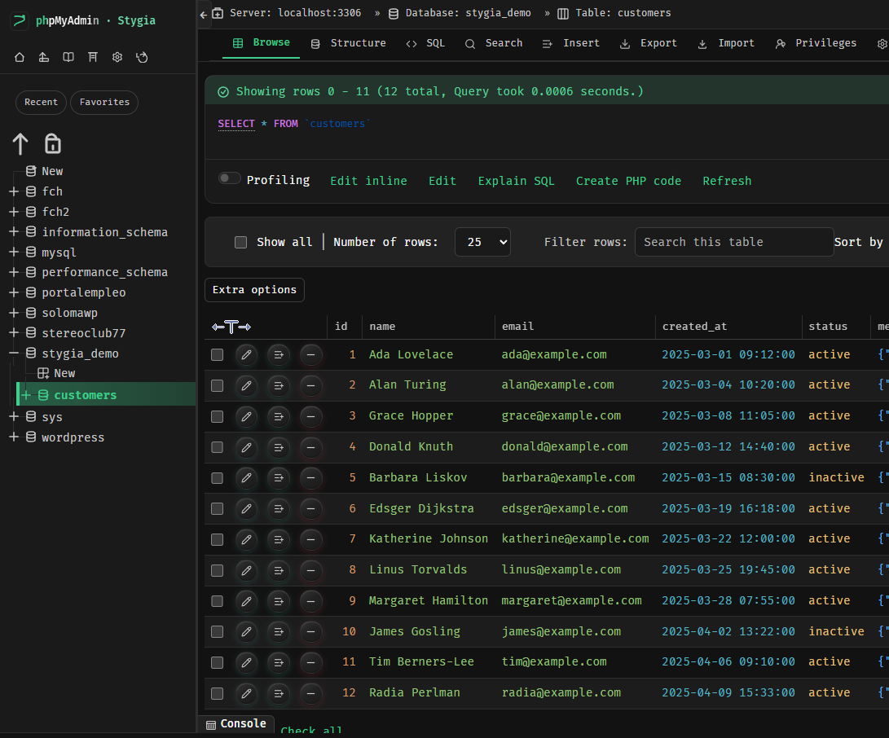
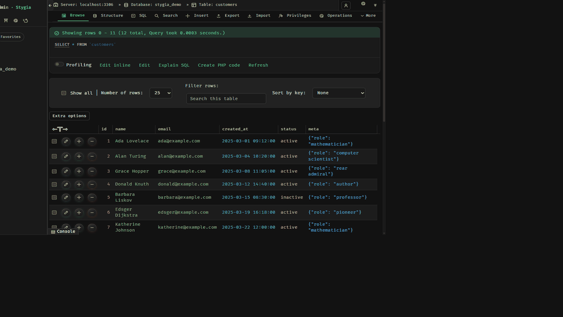

# Stygia — phpMyAdmin Dark Theme

A dark, elegant theme for [phpMyAdmin](https://www.phpmyadmin.net/) 6.x inspired by the mythological river Styx. Deep green accents, accessible contrast, RTL overrides, and a dense but calm admin UI.

[](https://www.phpmyadmin.net/)
[](CHANGELOG.md)
[](LICENSE)
[](docs/DESIGN.md)



<p align="center">
  
</p>

## Features

- **Deep dark surfaces** — `#121212` body, stepped elevation for cards and popovers
- **Stygia green** — `#3ecf8e` accent with a darker primary button (`#006239`) that stays readable
- **Accessible** — `:focus-visible`, `prefers-reduced-motion`, `prefers-contrast`, `forced-colors`; body/link/button pairs target WCAG AA
- **RTL** — full `theme.rtl.css` via rtlcss(theme.css) plus Stygia overrides (SQL stays LTR)
- **Typography** — bundled Inter (300–600) + JetBrains Mono (woff2, no CDN). If **FiraCode Nerd Font** is installed, it is used first (Propo for UI, Mono for SQL)
- **Icon system** — Lucide (ISC) adapted for CSS masks, 16px glyphs in 28–32px controls, distinct Browse/Structure/Insert/Empty/Drop metaphors, generated catalog + `npm run icons:check`
- **Tabs** — phpMyAdmin `nav-pills` restyled as underline tabs; green pills stay on Go/Save only
- **Typed cells** — browse/insert values colored with [One Dark Pro](https://github.com/Binaryify/OneDark-Pro) tokens (int, string, date, json, …)
- **SQL editor** — CodeMirror highlighting on the same One Dark Pro palette
- **Inspectable tokens** — Sass variables mirrored on `:root` as `--stygia-*`
- **Branding** — in-app: river mark + `phpMyAdmin · STYGIA`; portfolio: Stygia mark alone
- **jQuery UI** — dark ui-darkness base + Stygia color overrides for datepicker/dialogs

## Requirements

- phpMyAdmin 6.0 or higher
- Modern browser (Chrome, Firefox, Safari, Edge)

## Installation

1. Download `stygia.zip` from [Releases](https://github.com/horaciodominguez/stygia/releases) or clone this repository
2. Place the `stygia` folder in your phpMyAdmin themes directory:

```
phpMyAdmin/
└── themes/
    └── stygia/
        ├── css/
        ├── fonts/
        ├── img/
        ├── jquery/
        ├── scss/
        ├── theme.json
        └── screen.png
```

3. phpMyAdmin → Appearance Settings → Theme → **Stygia** → Save

## Build from source

The GitHub clone compiles without a phpMyAdmin tree:

```bash
npm install
npm run build
```

Regenerate or audit the icon family:

```bash
npm run icons:generate
npm run icons:check
```

Watch mode:

```bash
npm run watch
```

Package a distributable zip:

```bash
npm run zip
```

## Theme structure

```
stygia/
├── css/                 # theme.css + theme.rtl.css (rtlcss) + maps
├── fonts/               # Inter + JetBrains Mono (OFL)
├── img/                 # SVG icons + logo
├── jquery/              # Dark jQuery UI + images
├── scss/
│   ├── theme.scss       # Entry
│   ├── _variables.scss  # Design tokens
│   ├── _tokens.scss     # :root --stygia-* custom properties
│   ├── _fonts.scss
│   ├── _icons.scss
│   ├── _nav.scss        # Underline tabs (nav-pills)
│   ├── _datatypes.scss  # One Dark Pro cell colors
│   ├── _login.scss
│   ├── _console.scss
│   ├── _rtl-overrides.scss
│   └── ...
├── docs/DESIGN.md       # Case study + contrast notes
├── theme.json
└── screen.png
```

## Customization

Edit `scss/_variables.scss`, then:

```bash
npm run build
```

Runtime-inspectable copies live on `:root` as `--stygia-*` (see `scss/_tokens.scss`).

To force bundled Inter / JetBrains (ignore a local Nerd Font), remove the FiraCode names from `$font-family-base` / `$font-family-monospace` and rebuild.

| Token | Hex | Role |
| --- | --- | --- |
| `$accent-green` | `#3ecf8e` | Links, focus, active nav |
| `$accent-green-deep` | `#006239` | Primary buttons |
| `$bg-body` | `#121212` | Page background |
| `$bg-surface` | `#1a1a1a` | Cards / inputs |
| `$bg-popover` | `#242424` | Dropdowns / datepicker |
| `$text-primary` | `#fafafa` | Body text |
| `$text-secondary` | `#c8c8c8` | Secondary text |
| `$color-success` | `#5dd39e` | Success (not the same as primary) |
| `$color-danger` | `#f07178` | Errors |
| `$color-warning` | `#f5a623` | Warnings |
| `$color-info` | `#4ecdc4` | Info |

### One Dark Pro (SQL + typed cells)

| Token | Hex | Browse / SQL |
| --- | --- | --- |
| `$odp-whiskey` | `#d19a66` | int, real, numbers |
| `$odp-green` | `#98c379` | strings |
| `$odp-fountain-blue` | `#56b6c2` | dates / times |
| `$odp-coral` | `#e06c75` | blob, hex, errors |
| `$odp-malibu` | `#61afef` | json, geometry, builtins |
| `$odp-purple` | `#c678dd` | bit, keywords |
| `$odp-chalky` | `#e5c07b` | types, enum/set, UUID |
| `$odp-light-dark` | `#7f848e` | comments, null-ish |

Palette from [One Dark Pro](https://github.com/Binaryify/OneDark-Pro) (zhuangtongfa / Binaryify).

## Accessibility

Measured on `#121212` unless noted:

| Pair | Ratio | AA |
| --- | --- | --- |
| `#fafafa` on `#121212` | ~18:1 | Pass (normal) |
| `#c8c8c8` on `#121212` | ~11.5:1 | Pass (normal) |
| `#b0b0b0` on `#121212` | ~8.6:1 | Pass (normal) |
| `#3ecf8e` on `#121212` | ~9.4:1 | Pass (normal) |
| `#fafafa` on `#006239` | ~7.2:1 | Pass (normal) |
| `#949494` on `#121212` | ~6.0:1 | Pass (normal AA) |

Keyboard focus uses a 2px green outline (`:focus-visible`). Reduced motion disables console and hover transitions. This theme cannot inject a skip link into phpMyAdmin HTML; the `.skip-link` class is styled if the host page provides one.

## License

MIT — see [LICENSE](LICENSE). Fonts: SIL Open Font License (see [fonts/README.md](fonts/README.md)). jQuery UI dark pack adapted from [BooDark](https://github.com/adorade/boodark) (MIT). One Dark Pro token hues used by permission of the [MIT-licensed](https://github.com/Binaryify/OneDark-Pro/blob/master/LICENSE.md) VS Code theme.

Functional icons are adapted from [Lucide](https://lucide.dev) (`lucide-static`, ISC). Copyright (c) Lucide Contributors. Portions Copyright (c) Cole Bemis 2013-2023 as part of Feather (MIT). Permission to use, copy, modify, and/or distribute Lucide for any purpose with or without fee is granted, provided that this copyright notice and the ISC permission notice appear with the copies. The generated SVG files carry the same notice.

## Credits

Created by [Horacio Dominguez](https://github.com/horaciodominguez) for phpMyAdmin 6.x. Design notes: [docs/DESIGN.md](docs/DESIGN.md).
